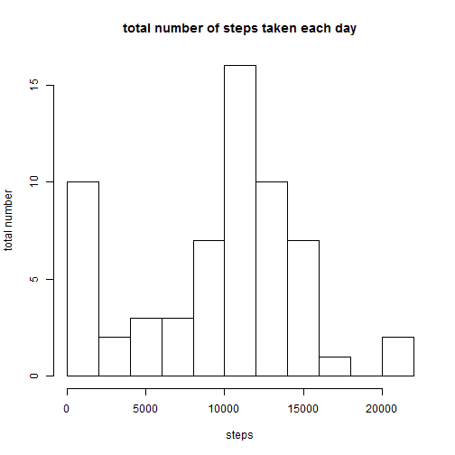
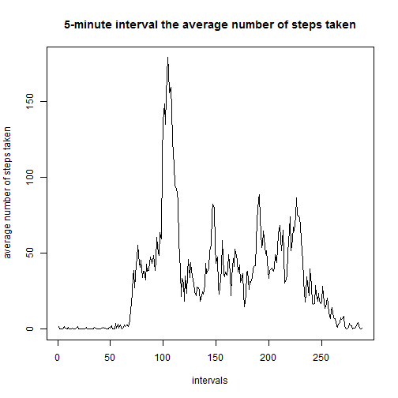
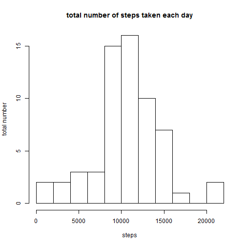
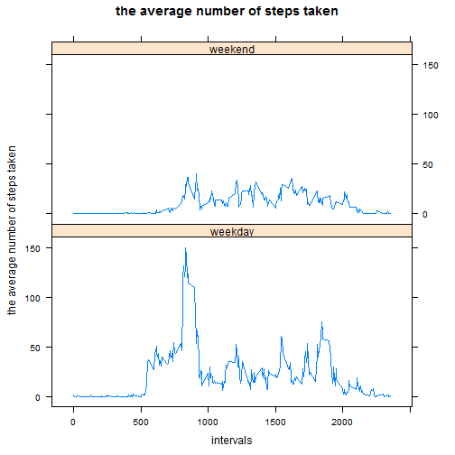

# Reproducible Research: Peer Assessment 1

## Loading and preprocessing the data
Load the data

```r
setwd("G:\\Learn\\Coursera\\Data Science\\5Reproducible Research\\assignment1\\submit")
file <- unz("activity.zip", "activity.csv")
data <- read.csv(file, sep = ",", header = T)
head(data)
```

```
##   steps       date interval
## 1    NA 2012-10-01        0
## 2    NA 2012-10-01        5
## 3    NA 2012-10-01       10
## 4    NA 2012-10-01       15
## 5    NA 2012-10-01       20
## 6    NA 2012-10-01       25
```


## What is mean total number of steps taken per day?
Make a histogram of the total number of steps taken each day

```r
data1 <- aggregate(data$steps, by = list(date = data$date), sum, na.rm = TRUE)
hist(data1$x, breaks = 10, main = "total number of steps taken each day", xlab = "steps", 
    ylab = "total number")
```

 

Calculate and report the mean and median total number of steps taken per day

```r
mean(data1$x, na.rm = TRUE)
```

```
## [1] 9354
```

```r
median(data1$x, na.rm = TRUE)
```

```
## [1] 10395
```


## What is the average daily activity pattern?
Make a time series plot (i.e. type = "l") of the 5-minute interval (x-axis) and the average number of steps taken, averaged across all days (y-axis)

```r
data2 <- aggregate(data$steps, by = list(date = data$interval), sum, na.rm = TRUE)
daysCount <- length(levels(data$date))
plot(data2$x/daysCount, type = "l", main = "5-minute interval the average number of steps taken", 
    xlab = "intervals", ylab = "average number of steps taken")
```

 

Which 5-minute interval, on average across all the days in the dataset, contains the maximum number of steps

```r
intervalsCount <- data2$x/daysCount
which.max(intervalsCount)
```

```
## [1] 104
```

## Imputing missing values
Calculate and report the total number of missing values in the dataset: the total number of rows with NAs

```r
sum(is.na(data))
```

```
## [1] 2304
```

Devise a strategy for filling in all of the missing values in the dataset. use the mean for that 5-minute interval.

```r
newdata <- data
for (i in 1:length(newdata$steps)) if (is.na(newdata$steps[i])) newdata$steps[i] <- intervalsCount[i%%288 + 
    1]
```

Create a new dataset that is equal to the original dataset but with the missing data filled in.

```r
head(newdata)
```

```
##     steps       date interval
## 1 0.29508 2012-10-01        0
## 2 0.11475 2012-10-01        5
## 3 0.13115 2012-10-01       10
## 4 0.06557 2012-10-01       15
## 5 1.81967 2012-10-01       20
## 6 0.45902 2012-10-01       25
```

Make a histogram of the total number of steps taken each day and Calculate and report the mean and median total number of steps taken per day. 

```r
newdata1 <- aggregate(newdata$steps, by = list(date = newdata$date), sum)
hist(newdata1$x, breaks = 10, main = "total number of steps taken each day", 
    xlab = "steps", ylab = "total number")
```

 

```r
mean(newdata1$x)
```

```
## [1] 10581
```

```r
median(newdata1$x)
```

```
## [1] 10395
```

answer:

The mean of total number of steps taken per day is different from assignment1

The median of total number of steps taken per day is the same as assignment1

## Are there differences in activity patterns between weekdays and weekends?
Create a new factor variable in the dataset with two levels ¨C ¡°weekday¡± and ¡°weekend¡± indicating whether a given date is a weekday or weekend day

```r
Sys.setlocale("LC_TIME", "English")
```

```
## [1] "English_United States.1252"
```

```r
weeklevel <- c("Monday", "Tuesday", "Wednesday", "Thursday", "Friday", "Saturday", 
    "Sunday")
data$weekday <- factor(as.character(weekdays(as.Date(data$date))), order = TRUE, 
    levels = weeklevel)
data$isweekend[as.numeric(data$weekday) > 5] <- "weekend"
data$isweekend[as.numeric(data$weekday) <= 5] <- "weekday"
data$isweekend <- factor(data$isweekend, order = TRUE, levels = c("weekday", 
    "weekend"))
levels(data$isweekend)
```

```
## [1] "weekday" "weekend"
```

Make a panel plot containing a time series plot of the 5-minute interval (x-axis) and the average number of steps taken, averaged across all weekday days or weekend days (y-axis).

```r
data3 <- aggregate(data$steps, by = list(interval = data$interval, isweekend = data$isweekend), 
    sum, na.rm = TRUE)
daysCount <- length(levels(data$date))
library(lattice)
```

```
## Warning: package 'lattice' was built under R version 3.0.2
```

```r
xyplot(x/daysCount ~ interval | isweekend, data = data3, type = "l", layout = c(1, 
    2), main = "the average number of steps taken", ylab = "the average number of steps taken", 
    xlab = "intervals")
```

 


